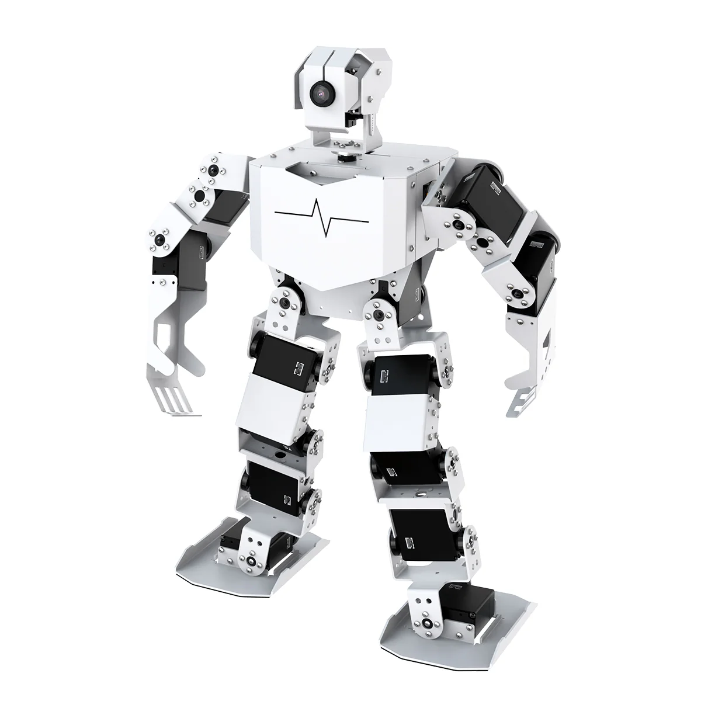

# TonyPi

English | [中文](https://github.com/Hiwonder/TonyPi/blob/main/README_cn.md)

<p align="center">
  
</p>

## Product Overview

TonyPi is an AI humanoid robot developed by Hiwonder based on Raspberry Pi 5. It features high-pressure smart bus servos, a 2-DOF high-definition camera, and a dual-brain architecture control system. Using OpenCV as the image processing library and Python programming, it can complete creative AI interaction functions such as color recognition, target tracking, ball kicking and line following, and MediaPipe gesture control. Combined with the APP, even beginners can quickly get started with the experience.

TonyPi also deploys multimodal AI large models. Combined with AI voice interaction box, it can understand the environment, plan actions and flexibly execute tasks, enabling more advanced embodied intelligence applications.

## Official Resources

### Official Hiwonder

- **Official Website**: [https://www.hiwonder.net/](https://www.hiwonder.net/)
- **Product Page**: [https://www.hiwonder.com/products/tonypi](https://www.hiwonder.com/products/tonypi)
- **Official Documentation**: [https://docs.hiwonder.com/projects/TonyPi/en/latest/](https://docs.hiwonder.com/projects/TonyPi/en/latest/)
- **Technical Support**: support@hiwonder.com

## Key Features

### AI Vision Functions

- **Color Recognition** - Advanced color detection and identification
- **Target Tracking** - Real-time object tracking with AI algorithms
- **Face Detection** - Comprehensive face recognition capabilities
- **Gesture Control** - MediaPipe-based gesture recognition and control
- **AprilTag Detection** - Precision tag recognition for navigation
- **Visual Patrol** - Intelligent visual surveillance and monitoring

### Motion Control Functions

- **Ball Kicking** - Precise ball interaction and kicking motions
- **Line Following** - Autonomous line tracking navigation
- **Running** - Dynamic running and movement patterns
- **Remote Control** - Wireless control via APP and network
- **Head Control** - 2-DOF camera head movement
- **Transport** - Object transportation capabilities

### Intelligent Interaction

- **Voice Interaction** - Natural language voice commands
- **Gesture Control** - Hand gesture recognition and response
- **Fall Detection** - Smart fall detection and recovery
- **Obstacle Avoidance** - Intelligent obstacle detection and avoidance
- **Follow Mode** - Person following capabilities

### Programming Interface

- **Python Programming** - Complete Python SDK
- **RPC Interface** - JSON-RPC remote calls
- **Video Stream** - Real-time MJPG video streaming
- **Action Groups** - Pre-defined motion sequences
- **Sensor Integration** - Multiple sensor support

## Hardware Configuration

- **Processor**: Raspberry Pi 5
- **Servo System**: High-pressure smart bus servos
- **Vision System**: 2-DOF high-definition camera
- **Control Architecture**: Dual-brain control system
- **Sensors**: Distance sensor, touch sensor, gyroscope
- **Audio**: Voice interaction box with TTS/ASR
- **Indicators**: RGB LED, buzzer
- **Communication**: WiFi, Bluetooth

## Project Structure

```
TonyPi/
├── TonyPi.py                   # Main program entry
├── Camera.py                   # Camera control module
├── RPCServer.py               # RPC server
├── MjpgServer.py              # Video stream server
├── ActionGroups/              # Motion action sequences
├── Functions/                 # Function modules
│   ├── ColorDetect.py         # Color detection
│   ├── FaceDetect.py          # Face detection
│   ├── gesture_control.py     # Gesture control
│   ├── KickBall.py            # Ball kicking
│   ├── Follow.py              # Following function
│   ├── Transport.py           # Transportation
│   ├── obstacle_avoidance.py  # Obstacle avoidance
│   └── voice_interaction/     # Voice interaction
├── HiwonderSDK/               # Hardware control SDK
├── Extend/                    # Extended functions
│   ├── sensor_course/         # Sensor applications
│   ├── athletics_course/      # Athletic functions
│   ├── vision_grab_course/    # Vision grabbing
│   └── multi_control/         # Multi-robot control
├── lab_config.yaml            # Color recognition config
└── servo_config.yaml          # Servo configuration
```

## Version Information

- **Current Version**: v1.0.0 (2024-10-20)
- **Supported Platform**: Raspberry Pi 5

### Related Technologies

- [OpenCV](https://opencv.org/) - Computer Vision Library
- [MediaPipe](https://mediapipe.dev/) - Machine Learning Framework
- [Python](https://www.python.org/) - Programming Language

---

**Note**: This program is pre-installed on the TonyPi robot system and can be run directly. For detailed tutorials, please refer to the [Official Documentation](https://docs.hiwonder.com/projects/TonyPi/en/latest/).