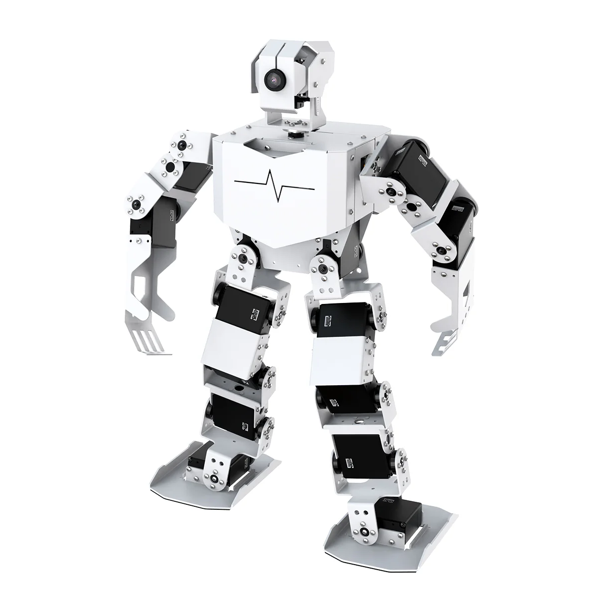

# TonyPi

[English](https://github.com/Hiwonder/TonyPi/blob/main/README.md) | 中文

<p align="center">
  
</p>

基于树莓派5的AI人形机器人，集成计算机视觉、语音交互、体感控制等AI功能。

## 产品介绍

TonyPi是幻尔基于树莓派5开发的AI人形机器人。它的机身搭载了高压智能总线舵机、2自由度高清摄像头及双脑构架控制系统,以OpenCV为图像处理库,采用Python编程,能完成颜色识别、目标追踪、踢球巡线、MediaPipe体感控制等创意AI交互玩法。结合APP,零基础也可以快速上手体验。

TonyPi还部署了多模态AI大模型,结合AI语音交互盒,它可以理解环境、规划行动并灵活执行任务,能实现更多高阶具身智能应用。

## 官方资源

### Hiwonder官方

- **官方网站**: [https://www.hiwonder.net/](https://www.hiwonder.net/)
- **产品页面**: [https://www.hiwonder.com/products/tonypi](https://www.hiwonder.com/products/tonypi)
- **官方文档**: [https://docs.hiwonder.com/projects/TonyPi/en/latest/](https://docs.hiwonder.com/projects/TonyPi/en/latest/)
- **技术支持**: support@hiwonder.com

## 主要功能

### AI视觉功能

- **颜色识别** - 先进的颜色检测和识别
- **目标追踪** - 基于AI算法的实时目标追踪
- **人脸检测** - 全面的人脸识别能力
- **体感控制** - 基于MediaPipe的手势识别和控制
- **AprilTag检测** - 精确的标签识别用于导航
- **视觉巡逻** - 智能视觉监控和巡视

### 运动控制功能

- **踢球功能** - 精确的球类交互和踢球动作
- **巡线功能** - 自主巡线跟踪导航
- **跑步功能** - 动态跑步和运动模式
- **遥控功能** - 通过APP和网络的无线控制
- **云台控制** - 2自由度摄像头云台运动
- **搬运功能** - 物体搬运能力

### 智能交互

- **语音交互** - 自然语言语音命令
- **手势控制** - 手势识别和响应
- **跌倒检测** - 智能跌倒检测和恢复
- **自动避障** - 智能障碍物检测和避障
- **跟随模式** - 人体跟随能力

### 编程接口

- **Python编程** - 完整的Python SDK
- **RPC接口** - JSON-RPC远程调用
- **视频流** - 实时MJPG视频流传输
- **动作组** - 预定义的动作序列
- **传感器集成** - 多传感器支持

## 硬件配置

- **处理器**: 树莓派5
- **舵机系统**: 高压智能总线舵机
- **视觉系统**: 2自由度高清摄像头
- **控制架构**: 双脑控制系统
- **传感器**: 距离传感器、触摸传感器、陀螺仪
- **音频**: 带TTS/ASR的语音交互盒
- **指示器**: RGB LED灯、蜂鸣器
- **通信**: WiFi、蓝牙

## 项目结构

```
TonyPi/
├── TonyPi.py                   # 主程序入口
├── Camera.py                   # 摄像头控制模块
├── RPCServer.py               # RPC服务器
├── MjpgServer.py              # 视频流服务器
├── ActionGroups/              # 动作组序列
├── Functions/                 # 功能模块
│   ├── ColorDetect.py         # 颜色检测
│   ├── FaceDetect.py          # 人脸检测
│   ├── gesture_control.py     # 手势控制
│   ├── KickBall.py            # 踢球功能
│   ├── Follow.py              # 跟随功能
│   ├── Transport.py           # 搬运功能
│   ├── obstacle_avoidance.py  # 避障功能
│   └── voice_interaction/     # 语音交互
├── HiwonderSDK/               # 硬件控制SDK
├── Extend/                    # 扩展功能
│   ├── sensor_course/         # 传感器应用
│   ├── athletics_course/      # 竞技功能
│   ├── vision_grab_course/    # 视觉抓取
│   └── multi_control/         # 多机器人控制
├── lab_config.yaml            # 颜色识别配置
└── servo_config.yaml          # 舵机配置
```

## 版本信息

- **当前版本**: 2025-8-26
- **支持平台**: 树莓派5

### 相关技术

- [OpenCV](https://opencv.org/) - 计算机视觉库
- [MediaPipe](https://mediapipe.dev/) - 机器学习框架
- [Python](https://www.python.org/) - 编程语言

---

**注**: 所有程序已预装在TonyPi机器人系统中，可直接运行。详细使用教程请参考[官方文档](https://docs.hiwonder.com/projects/TonyPi/en/latest/)。
